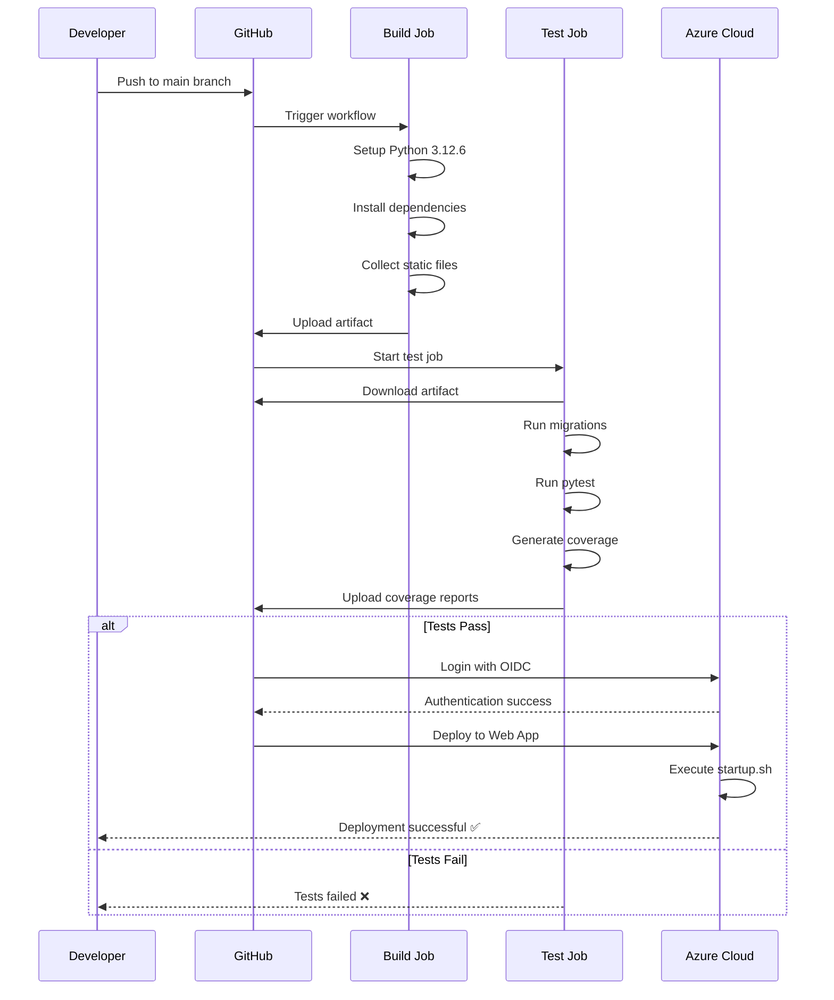
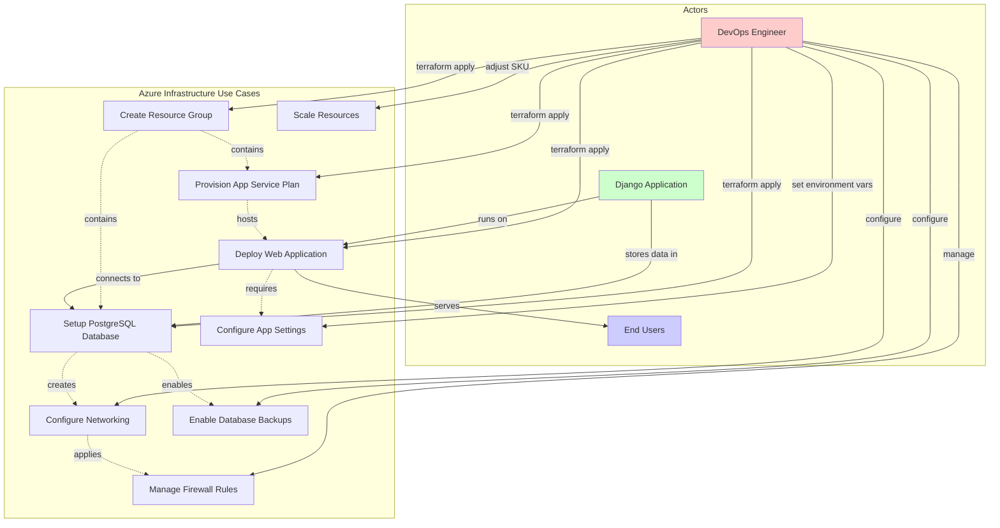
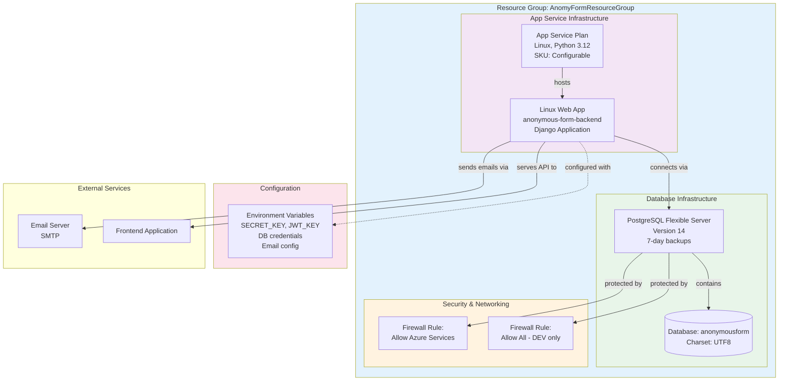
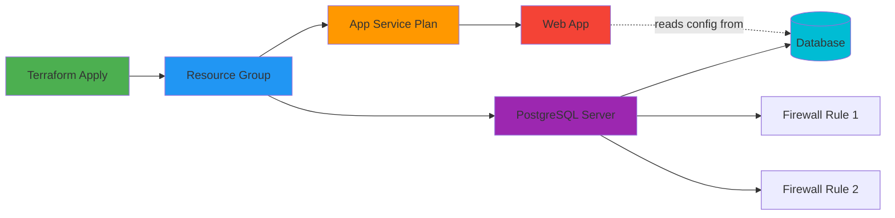
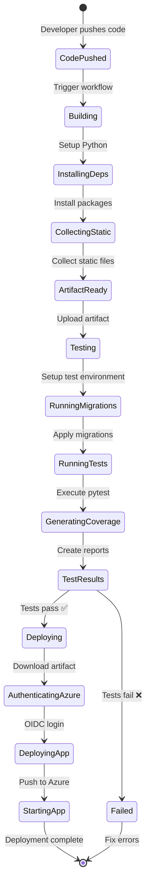

# Project Diagrams

## 1. GitHub Actions CI/CD Pipeline - Activity Diagram

```mermaid
graph TB
    Start([Push to main branch]) --> CheckPath{Changes in<br/>backend/ or<br/>workflow?}
    CheckPath -->|No| End([End])
    CheckPath -->|Yes| BuildJob[Build Job]
    
    subgraph Build["🔨 Build Job"]
        B1[Checkout Code]
        B2[Setup Python 3.12.6]
        B3[Create Virtual Environment]
        B4[Install Dependencies]
        B5[Collect Static Files]
        B6[Upload Artifact]
        
        B1 --> B2 --> B3 --> B4 --> B5 --> B6
    end
    
    BuildJob --> B1
    B6 --> TestJob[Test Job]
    
    subgraph Test["🧪 Test Job"]
        T1[Download Artifact]
        T2[Checkout Code]
        T3[Setup Python 3.12.6]
        T4[Create Virtual Environment]
        T5[Install Dependencies]
        T6[Run Database Migrations]
        T7[Run Pytest with Coverage]
        T8[Upload Coverage Reports]
        T9[Display Test Summary]
        
        T1 --> T2 --> T3 --> T4 --> T5 --> T6 --> T7 --> T8 --> T9
    end
    
    TestJob --> T1
    T9 --> TestPassed{Tests<br/>Passed?}
    TestPassed -->|No| End
    TestPassed -->|Yes| DeployJob[Deploy Job]
    
    subgraph Deploy["🚀 Deploy Job"]
        D1[Download Artifact]
        D2[Login to Azure<br/>OIDC Authentication]
        D3[Deploy to Azure Web App<br/>Production Slot]
        D4[Execute startup.sh]
        
        D1 --> D2 --> D3 --> D4
    end
    
    DeployJob --> D1
    D4 --> Success([✅ Deployment Complete])
    
    style Build fill:#e1f5ff
    style Test fill:#fff4e1
    style Deploy fill:#e7ffe1
    style Success fill:#c8ffc8
```



## 2. GitHub Actions - Sequence Diagram



## 3. Terraform Infrastructure - Use Case Diagram



## 4. Terraform Infrastructure - Component Diagram



## 5. Terraform Resource Dependencies



## 6. CI/CD Pipeline - Deployment Flow



## 7. Infrastructure Architecture Overview

```
┌─────────────────────────────────────────────────────────────────┐
│                         Azure Cloud                              │
│                                                                   │
│  ┌───────────────────────────────────────────────────────────┐  │
│  │         Resource Group: AnomyFormResourceGroup            │  │
│  │                                                           │  │
│  │  ┌─────────────────────┐      ┌───────────────────────┐ │  │
│  │  │  App Service Plan    │      │  PostgreSQL Server    │ │  │
│  │  │  ┌───────────────┐  │      │  ┌─────────────────┐  │ │  │
│  │  │  │ Linux Web App │  │      │  │   Database      │  │ │  │
│  │  │  │               │  │◄────►│  │  anonymousform  │  │ │  │
│  │  │  │ Django API    │  │ TCP  │  │                 │  │ │  │
│  │  │  │ Python 3.12   │  │ 5432 │  │   PostgreSQL    │  │ │  │
│  │  │  └───────────────┘  │      │  └─────────────────┘  │ │  │
│  │  │                     │      │                       │ │  │
│  │  │  Environment Vars   │      │  Firewall Rules:     │ │  │
│  │  │  • SECRET_KEY       │      │  • Azure Services    │ │  │
│  │  │  • JWT_KEY          │      │  • Development IPs   │ │  │
│  │  │  • DB Credentials   │      │  • 7-day backups     │ │  │
│  │  └─────────────────────┘      └───────────────────────┘ │  │
│  └───────────────────────────────────────────────────────────┘  │
└─────────────────────────────────────────────────────────────────┘
                              ▲
                              │
                              │ HTTPS
                              │
                    ┌─────────┴──────────┐
                    │                    │
              ┌─────▼─────┐      ┌──────▼──────┐
              │  End Users │      │   CI/CD     │
              │  (Browser) │      │  Pipeline   │
              └────────────┘      └─────────────┘
```

## Key Components Summary

### GitHub Actions Workflow
- **Trigger**: Push to `main` branch with backend changes
- **Jobs**: 
  1. **Build** - Prepare application artifacts
  2. **Test** - Run automated tests with coverage
  3. **Deploy** - Deploy to Azure using OIDC authentication
- **Artifacts**: Python application with collected static files
- **Test Framework**: Pytest with coverage reporting

### Terraform Infrastructure
- **Cloud Provider**: Azure
- **Main Resources**:
  - App Service Plan (Linux, Python 3.12)
  - PostgreSQL Flexible Server (v14)
  - Firewall rules for security
  - Automated backups
- **Environment**: Production-ready with configurable SKUs
- **Security**: OIDC authentication, firewall rules, encrypted connections

